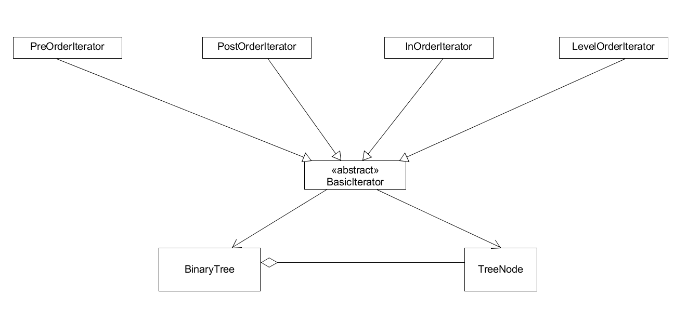
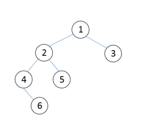
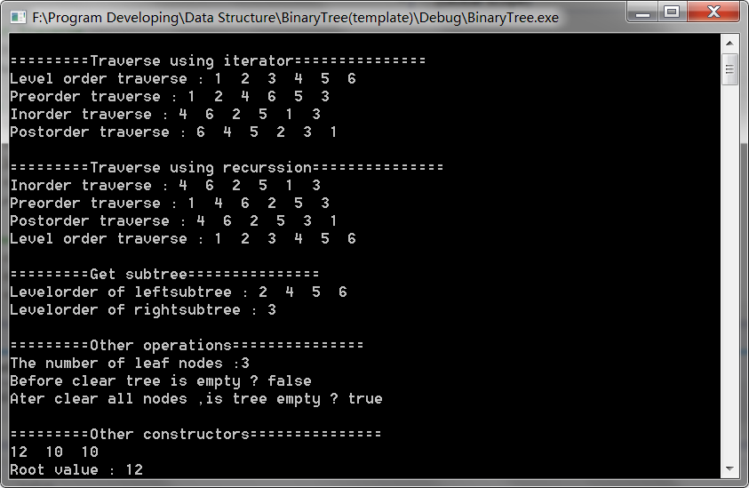

# Binary Tree
---
## Description:
**A simple project to implement template binary tree.**

## Class diagram:

---
## How to use class:'BinaryTree'
To use template tree, one need to include its header file firstly:

	#include "BinaryTree"

> ### 1. addTerm(T& value)
> Add a node in the binary tree given the value of node.
>### 2. isEmpty()
>Determin whether the tree is empty.
>### 3. countLeaves()
>Count the number of leaf nodes.
>### 4. clearAll()
> Clear all nodes.
> ### 5. leftSubTree()
> Get left subtree.
> ### 6. rightSubTree()
> Get right subtree.
> ### 7. preTraverse()
> Traverse tree in preorder.
> ### 8. inTraverse()
> Traverse tree in inorder.
> ### 9. postTraverse()
> Traverse tree in postorder.
> ### 10. levelTraverse()
> TRaverse tree in levelorder.

---
## How to use traverse iterator
To use traverse iterator ,one need to include its header file firstly:
	
	#include "Iterators"

One can use traverse iterator just by passing an instance of class:'BinaryTree' to iterator's constructor:
	
	PreOrderIterator iter(tree);
	while(iter.next())
	{
		cout<<*iter;
	}

Iterators are also polymorphic:

	BasicIterator<typename>* iter=new PreOrderIterator<typename>(tree);
	while(iter->next())
	{
		cout<<*(*iter);
	}

---
## Example
### Test on this bianary tree:

### Test Code

	#include "Iterators.h"
	#include "BinaryTree.h"
	#include <iostream>
	#include <cstdlib>
	using namespace std;

    int main()
	{
		//Add nodes into tree.
		BinaryTree<int> tree(1);
		tree.addNode(1,2,true);
		tree.addNode(1,3,false);
		tree.addNode(2, 4, true);
		tree.addNode(2, 5, false);
		tree.addNode(4, 6, false);

		//test traverse
		testIterator(tree);
		testRecurssion(tree);

		//get subtrees
		cout << "\n=========Get subtree===============\n";
		cout << "Levelorder of leftsubtree : ";
		tree.leftSubTree().levelTraverse();
		cout << "Levelorder of rightsubtree : ";
		tree.rightSubTree().levelTraverse();
		
		//test traverse in prelorder using recurssion
		tree.preTraverse();

		//test traverse in postorder using iterator
		BasicIterator<int>* iter=new PostOrderIterator<int>(tree);
		while(iter->next())
		{
			cout<<*(*iter)<<"  ";
		}
 
		//other operations
		cout << "\n=========Other operations===============\n";
		cout << "The number of leaf nodes :" << tree.countLeaves() << endl;
		cout << "Before clear tree is empty ? " << boolalpha << tree.isEmpty() << endl;
		tree.clearAll();
		cout << "Ater clear all nodes ,is tree empty ? " << boolalpha << tree.isEmpty() << endl;
	
		system("pause");
		return 0;
	}

### The output:

